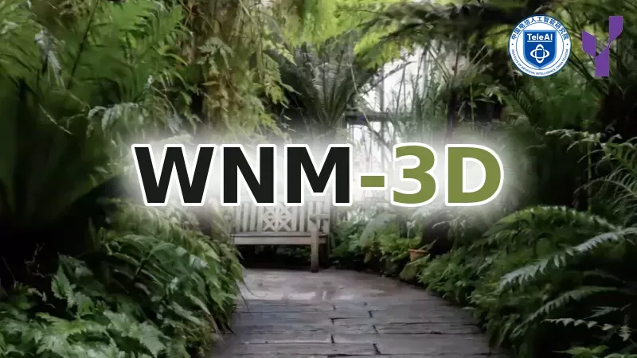
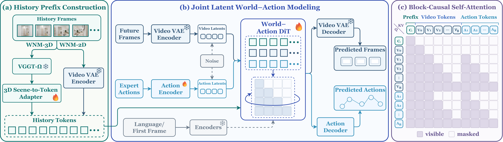

<div align="center">



<p>
  <a href="https://wnm-3d.github.io/"></a>
  <a href="https://arxiv.org/abs/2608.07267"></a>
  <!-- <a href="https://huggingface.co/TeleEmbodied/WNM-3D"></a> -->
  <a href="https://huggingface.co/datasets/TeleEmbodied/GN-Matrix"></a>
  <a href="https://github.com/TeleHuman/GN0"></a>
  <a href="https://github.com/TeleHuman/WNM-3D-RL"></a>
  <a href="assets/wechat.jpg"></a>
</p>

</div>

> Yuehao Huang<sup>1,2,3,†</sup>, Yunzi Wu<sup>1,2,4,†</sup>, Xiaotao Zhang<sup>1,2,5,†</sup>, Xinhai Li<sup>1,2,‡</sup>, Jiankun Dong<sup>1,2</sup>, Jiajun Lv<sup>3</sup>, Chi Zhang<sup>1,2</sup>, Chenjia Bai<sup>1,2,&#42;</sup>, Yong Liu<sup>3,&#42;</sup>, Xuelong Li<sup>1,2,&#42;</sup><br>
> <sup>1</sup> Institute of Artificial Intelligence, China Telecom &nbsp; <sup>2</sup> Gamma Robotics &nbsp; <sup>3</sup> Zhejiang University &nbsp; <sup>4</sup> Tongji University &nbsp; <sup>5</sup> Shanghai Jiao Tong University<br>
> <sup>†</sup> Equal Contributions &nbsp; <sup>‡</sup> Project Leader &nbsp; <sup>&#42;</sup> Corresponding Authors

## 🏠 Overview

WNM-3D is a generative **World Navigation Model** for continuous
vision-language navigation (VLN). It converts monocular egocentric RGB history
into persistent geometry-aware scene tokens that jointly condition future-view
and navigation-action generation in a block-causal world-action model.

<p align="center">
  
</p>

### Highlights

- **3D scene conditioning.** A frozen VGGT-Ω and trainable 3D Scene-to-Token
  Adapter form a fixed-length geometry-aware prefix.
- **Joint world-action generation.** A block-causal DiT jointly predicts future
  views and temporally aligned navigation actions.
- **Progressive closed-loop learning.** A\* SFT, DAgger-SFT, and Counterfactual
  DanceGRPO progressively adapt the policy from expert demonstrations to
  policy-visited states and reward-guided refinement. On GN-Bench, WNM-3D
  outperforms strong VLM-based policies and its 2D-conditioned counterpart.

## 📖 News

- `[2026-08-12]` We launched the official [project website](https://wnm-3d.github.io).
- `[2026-08-07]` Our paper is available on [arXiv](https://arxiv.org/abs/2608.07267).

---

## 📋 Table of Contents

- [🏠 Overview](#-overview)
- [📖 News](#-news)
- [📚 Installation](#-installation)
- [🤗 Downloads](#-downloads)
- [📁 Layout](#-layout)
- [🚀 Inference](#-inference)
- [🚆 Training](#-training)
- [🔗 Citation](#-citation)
- [👏 Acknowledgements](#-acknowledgements)
- [📄 License](#-license)

## 📚 Installation

Follow the [installation guide](docs/INSTALLATION.md) to configure PyTorch,
CUDA, project dependencies, FlashAttention, and GN-Bench.

## 🤗 Downloads

The [downloads guide](docs/DOWNLOADS.md) provides the official WNM-3D
checkpoint, benchmark datasets, and optional initialization weights for
training.

## 📁 Layout

The recommended workspace places WNM-3D and GN0 under a common parent
directory. Only the external checkpoints and benchmark data are shown below:

```text
workspace/
├── WNM-3D/
│   └── checkpoints/
│       ├── wnm_3d_stage3_release/
│       ├── Wan2.2-TI2V-5B/
│       ├── Wan2.1-I2V-14B-480P/
│       ├── umt5-xxl/
│       └── vggt_omega_1b_512.pt
└── GN0/
    └── data/
        ├── datasets/
        │   └── GN_Matrix/
        │       └── InteriorGS/
        │           ├── InteriorGS_train_seen.parquet
        │           ├── InteriorGS_test_seen.parquet
        │           └── InteriorGS_test_unseen.parquet
        └── scene_datasets/
            └── InteriorGS/
                ├── 0001_839920/
                ├── 0002_839955/
                └── ...
```

The checkpoint entries may be regular files, directories, or local symbolic
links.

## 🚀 Inference

### WebSocket Server

> [!NOTE]
> The server binds to `127.0.0.1` by default. Use `--host 0.0.0.0` only on a
> trusted network or behind an authenticated reverse proxy and firewall.

The default command launches eight independent single-GPU policy replicas on
ports `8000` through `8007`:

```bash
bash scripts/inference/wnm_3d_server.sh \
  --model-path checkpoints/wnm_3d_stage3_release
```

`--num-replicas` controls the number of independent endpoints, while
`--gpus-per-replica` controls the distributed workers assigned to each
endpoint. The required device count is their product; devices are allocated in
the order listed by `--cuda-devices`.

Example single-GPU deployment using the default inference configuration:

```bash
bash scripts/inference/wnm_3d_server.sh \
  --model-path checkpoints/wnm_3d_stage3_release \
  --cuda-devices 0 \
  --num-replicas 1 \
  --base-port 8000
```

The reference single-replica deployment was validated on an NVIDIA H100 80 GB
GPU and used approximately 27 GiB of GPU memory after loading. Hardware notes
and scaling guidance are provided in the
[installation guide](docs/INSTALLATION.md#reference-hardware).

### WebSocket Client

The GN-Bench WebSocket client is provided by the companion GN0 repository.
After the policy servers are ready, open a separate shell from the WNM-3D
repository root and run:

```bash
cd ../GN0
conda activate bae

bash scripts/evaluation/eval_remote.sh \
  --exp-config configs/gn_bench/interiorgs/test_unseen.yaml \
  --enable-stall-recovery \
  --num-gpus 8 \
  --result-dir tmp/eval/wnm_3d_test_unseen
```

On the client, `--num-gpus` selects the number of GN-Bench GPU slots. With the
default one process per GPU, `--num-gpus 8` launches eight workers and connects
them in order to server ports `8000` through `8007`. Match this to the server's
`--num-replicas` value; for a single-GPU run, use `--num-gpus 1` on the client
and `--num-replicas 1` on the server. The client connects to
`127.0.0.1:8000` by default.
Use `--server-host` and `--server-port` when the policy server runs at a
different address.

To terminate all WNM-3D inference servers and GN-Bench remote evaluation
workers, run the cleanup script from the WNM-3D repository root:

```bash
bash scripts/inference/wnm_3d_kill_remote_eval.sh
```

Use `--dry-run` to inspect the repository-scoped processes before stopping
them. The cleanup command only selects processes owned by the current user.

## 🚆 Training

WNM-3D follows the three-stage progressive training curriculum introduced in
the paper:

- **Stage-I: Offline A\* SFT**
- **Stage-II: Closed-Loop DAgger-SFT**
- **Stage-III: Counterfactual DanceGRPO**

The [training guide](docs/TRAINING.md) covers Stage-I dataset rendering and
supervised training, Stage-II DAgger collection and fine-tuning, and Stage-III
reinforcement-learning integration.

## 🔗 Citation

If WNM-3D is useful for your research, please cite our paper:

```bibtex
@article{huang2026wnm_3d,
  title={WNM-3D: A World Navigation Model with 3D Scene Conditioning for Closed-Loop VLN},
  author={Huang, Yuehao and Wu, Yunzi and Zhang, Xiaotao and Li, Xinhai and Dong, Jiankun and Lv, Jiajun and Zhang, Chi and Bai, Chenjia and Liu, Yong and Li, Xuelong},
  journal={arXiv preprint arXiv:2608.07267},
  year={2026}
}
```

A machine-readable citation is available in [`CITATION.cff`](CITATION.cff).

## 👏 Acknowledgements

WNM-3D builds upon outstanding research projects and open-source software. We
sincerely thank their authors and contributors for making the following
resources available to the research community:

- [DreamZero](https://github.com/dreamzero0/dreamzero): The foundational
  world-action modeling framework for joint future-video and action prediction.
- [Wan 2.2](https://github.com/Wan-Video/Wan2.2): The video diffusion backbone
  and pretrained video generation components.
- [VGGT-Ω](https://github.com/facebookresearch/vggt-omega): The feed-forward
  geometry encoder used for 3D scene conditioning.
- [DINOv3](https://github.com/facebookresearch/dinov3): Vision Transformer
  components incorporated through the VGGT-Ω geometry encoder.
- [LeRobot](https://github.com/huggingface/lerobot): The dataset organization
  and processing conventions used by the training pipeline.
- [GN0/GN-Bench](https://github.com/TeleHuman/GN0): The closed-loop navigation
  simulation and evaluation framework.
- [GN-Matrix](https://huggingface.co/datasets/TeleEmbodied/GN-Matrix): The
  benchmark episodes and navigation annotations.
- [InteriorGS](https://huggingface.co/datasets/spatialverse/InteriorGS): The 3D
  Gaussian Splatting scenes used in our navigation experiments.

## 📄 License

The original and Apache-licensed portions of WNM-3D are distributed under the
[Apache License 2.0](LICENSE). The vendored VGGT-Ω and DINOv3 source is governed
by separate terms, including the
[FAIR Noncommercial Research License](LICENSES/FAIR_NONCOMMERCIAL_RESEARCH_LICENSE)
and the [DINOv3 License](LICENSES/DINOV3_LICENSE.md).

> [!IMPORTANT]
> WNM-3D as a complete distribution is not licensed solely under Apache-2.0.
> Use of the vendored VGGT-Ω components and released checkpoints is subject to
> the FAIR Noncommercial Research License and other applicable third-party
> terms.

Component-level attribution and license boundaries are documented in
[Third-Party Notices](docs/THIRD_PARTY_NOTICES.md). Model weights and datasets
are also subject to the terms published by their respective providers.
