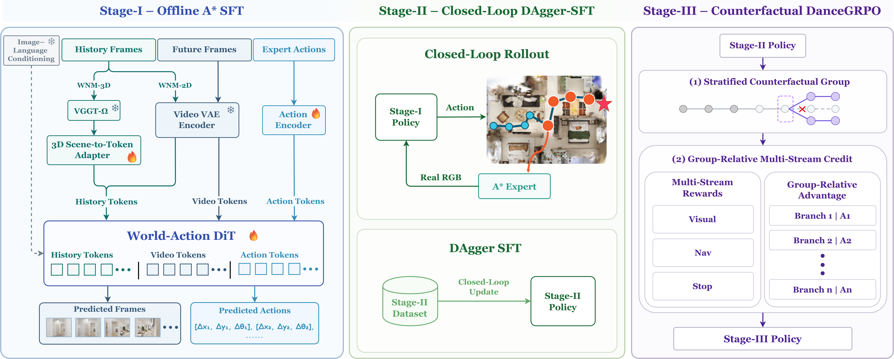

# Training

WNM-3D is trained with a three-stage curriculum that progresses from offline
expert supervision to closed-loop correction and reward-guided refinement.

| Stage | Objective | Initialization | Data |
| --- | --- | --- | --- |
| I | Offline A\* SFT | Wan, UMT5-XXL, and VGGT-Ω | A\* expert demonstrations |
| II | Closed-Loop DAgger-SFT | Stage-I checkpoint | Corrections at policy-visited states |
| III | Counterfactual DanceGRPO | Stage-II checkpoint | DAgger reference records |

<p align="center">
  
</p>

Stage-I and Stage-II training are provided in this repository. Stage-III
training is maintained in [WNM-3D-RL](https://github.com/TeleHuman/WNM-3D-RL).

## Setup

Complete the [installation](INSTALLATION.md) and [download](DOWNLOADS.md)
guides before training. WNM-3D and
[GN0](https://github.com/TeleHuman/GN0) should be sibling repositories:

```text
workspace/
├── WNM-3D/
└── GN0/
```

Use the `wnm_3d` environment for training and policy serving, and the `bae`
environment for GN0 rendering and DAgger collection.

> [!NOTE]
> Replace `<STEP>` with an actual saved step. Stage transitions should use an
> exact training checkpoint such as `checkpoint-10000`; directories ending in
> `_release` are published model artifacts and are not used by default for
> continued training.

The launchers accept environment-variable overrides such as
`INTERIORGS_DATA_ROOT`, `PRETRAINED_MODEL_PATH`, `OUTPUT_DIR`, `NUM_GPUS`, and
`MAX_STEPS`. Additional command-line arguments are forwarded to Hydra.

## Stage-I: Offline A\* SFT

Stage-I trains WNM-3D on expert trajectories from the GN-Matrix
`InteriorGS_train_seen` split.

### Prepare the dataset

Render the expert trajectories with GN0:

```bash
cd ../GN0
conda activate bae

bash scripts/evaluation/render_dataset.sh \
  --num-gpus 8 \
  --exp-config configs/gn_bench/interiorgs/train_seen.yaml \
  --result-dir ../WNM-3D/data/interiorgs_rendered_train_seen
```

Convert the rendered trajectories to the LeRobot format used by WNM-3D:

```bash
cd ../WNM-3D
conda activate wnm_3d

python scripts/data/convert_interiorgs_to_lerobot.py \
  --render-root data/interiorgs_rendered_train_seen \
  --annotations ../GN0/data/datasets/GN_Matrix/InteriorGS/InteriorGS_train_seen.parquet \
  --output-root data/interiorgs_lerobot_seen \
  --num-workers 8
```

### Supervised Fine-Tuning

Run single-node training from the WNM-3D repository root:

```bash
bash scripts/train/wnm_3d_stage1.sh
```

The default dataset and output directories are:

```text
data/interiorgs_lerobot_seen
checkpoints/wnm_3d_stage1
```

For multi-node training, launch the distributed script on every node with the
same `MASTER_ADDR` and a unique `NODE_RANK`:

```bash
# Node 0
MASTER_ADDR=10.0.0.1 NODE_RANK=0 \
  bash scripts/train/wnm_3d_stage1_distributed.sh

# Node 1
MASTER_ADDR=10.0.0.1 NODE_RANK=1 \
  bash scripts/train/wnm_3d_stage1_distributed.sh
```

## Stage-II: Closed-Loop DAgger-SFT

Stage-II rolls out the Stage-I policy in InteriorGS, queries the A\* expert at
visited states, and fine-tunes WNM-3D on the resulting corrections.

### Collect DAgger data

Start the Stage-I policy server from WNM-3D:

```bash
conda activate wnm_3d

STAGE1_CKPT="checkpoints/wnm_3d_stage1/checkpoint-<STEP>"

bash scripts/inference/wnm_3d_server.sh \
  --num-replicas 8 \
  --model-path "$STAGE1_CKPT"
```

In another shell, collect the Stage-II dataset with GN0:

```bash
cd ../GN0
conda activate bae

WNM3D_ROOT="$(cd ../WNM-3D && pwd)"

bash scripts/evaluation/eval_remote.sh \
  --exp-config configs/gn_bench/interiorgs/train_seen.yaml \
  --enable-stall-recovery \
  --num-gpus 8 \
  --result-dir tmp/dagger/wnm_3d_stage2 \
  --dagger \
  --dagger-output-root "$WNM3D_ROOT/data/interiorgs_dagger_3d_stage2" \
  --save-media none
```

Stop the workers and policy servers after collection:

```bash
cd ../WNM-3D
bash scripts/inference/wnm_3d_kill_remote_eval.sh
```

### Supervised Fine-Tuning

Select the exact Stage-I checkpoint used to initialize Stage II:

```bash
cd ../WNM-3D
conda activate wnm_3d

INTERIORGS_DATA_ROOT=data/interiorgs_dagger_3d_stage2 \
PRETRAINED_MODEL_PATH="checkpoints/wnm_3d_stage1/checkpoint-<STEP>" \
OUTPUT_DIR=checkpoints/wnm_3d_stage2 \
bash scripts/train/wnm_3d_stage2.sh
```

If `PRETRAINED_MODEL_PATH` is omitted, the launcher selects the latest
`checkpoint-*` under `checkpoints/wnm_3d_stage1`. For multi-node training, use
`wnm_3d_stage2_distributed.sh` with the same `MASTER_ADDR` and `NODE_RANK`
convention as Stage-I.

## Stage-III: Counterfactual DanceGRPO

Stage-III starts from a Stage-II checkpoint and uses DAgger reference records
for reward-guided refinement.

### Prepare reference records

Start the Stage-II policy server from WNM-3D:

```bash
conda activate wnm_3d

STAGE2_CKPT="checkpoints/wnm_3d_stage2/checkpoint-<STEP>"

bash scripts/inference/wnm_3d_server.sh \
  --num-replicas 8 \
  --model-path "$STAGE2_CKPT"
```

Collect the Stage-III records with GN0:

```bash
cd ../GN0
conda activate bae

WNM3D_ROOT="$(cd ../WNM-3D && pwd)"

bash scripts/evaluation/eval_remote.sh \
  --exp-config configs/gn_bench/interiorgs/train_seen.yaml \
  --enable-stall-recovery \
  --num-gpus 8 \
  --result-dir tmp/dagger/wnm_3d_stage3 \
  --dagger \
  --dagger-output-root "$WNM3D_ROOT/data/interiorgs_dagger_3d_stage3" \
  --save-media none
```

After collection, stop GN0 and the policy servers:

```bash
cd ../WNM-3D
bash scripts/inference/wnm_3d_kill_remote_eval.sh
```

### Train with WNM-3D-RL

Follow the instructions in
[WNM-3D-RL](https://github.com/TeleHuman/WNM-3D-RL) and provide:

- the Stage-II checkpoint:
  `../WNM-3D/checkpoints/wnm_3d_stage2/checkpoint-<STEP>`;
- the reference-data root:
  `../WNM-3D/data/interiorgs_dagger_3d_stage3`.
